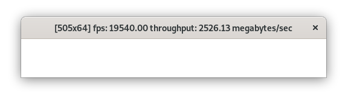

Utility for estimating `Graphics2D.drawImage()` performance. Draws picture in window  as fast as it can. 

## Use cases
This utility intended to help find proper graphical driver for legacy linux systems.

## How to build
`mvn clean install`

## Usage

Launch application: `java -jar swing-fps.jar`

Window title contains useful information, such as:

* frame dimensions
* frame draw rate (**fps**): Bigger is better.
* throughput measured in megabytes of picture data per second
